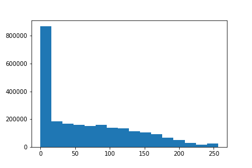

# Подсчёт гистограммы для изображения
Гистограмма по яркости для трёх каналов.

## Пример использования
```bash
./Histogram input.bmp count_of_intervals
```
Для изображения:  
  

Гистограммы с разбиением на 16 интервалов:
* Красный канал  
```
266890 117425 88201 76517 75328 79961 94574 109632 117295 131160 139967 154825 155659 136421 242124 471621 
```
  
* Зелёный канал  
```
135011 134337 138723 154880 175722 179475 192512 202883 217547 253623 231366 232836 125177 60318 18381 4809 
```
  
* Синий канал  
```
869177 183073 168932 157863 150557 158423 138065 132434 112845 104724 90476 68170 50508 30136 15589 26628 
```
  
